# 实验 0：上机环境准备

提示：你当然可以选择在机房电脑已有环境使用编译软件，但我们更推荐在自己电脑配置环境。


## 一、机房编程软件介绍(Dev-C++)

机房电脑已有的编程软件是 Dev-C++，这个软件我们将在下面介绍。

- 优点：开箱即用
- 缺点：操作不便，提前写好的文件上传繁琐，界面原始


## 二、个人电脑编程环境配置

这里我们将分别介绍 Windows 系统和 Linux 系统下常用的 C/C++ 编程软件，大家可以自行选择。当然如果你之前已经有一定的编程基础和熟练使用的软件，不妨继续使用~

### Windows

- 优点：大部分同学计算机入门都用 Windows
- 缺点：没有便捷的包管理器，操作繁琐

#### 1. [GCC](./assets/x86_64-15.2.0-release-mcf-seh-ucrt-rt_v13-rev0.7z)

下载好压缩包后，解压至你指定的目录，如：`C:\Dev` 或 `D:\App` 等，如果你缺少便捷无广的解压工具，点击这里[下载](./assets/7z2409-x64.exe)。然后将 `path\to\mingw64\bin` 加入到环境变量，例如：`C:\Dev\mingw64\bin`。

-  Win + R，输入 sysdm.cpl，确定；

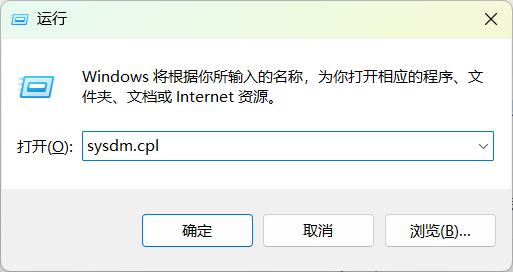

- 选择“高级”，点击“环境变量”；

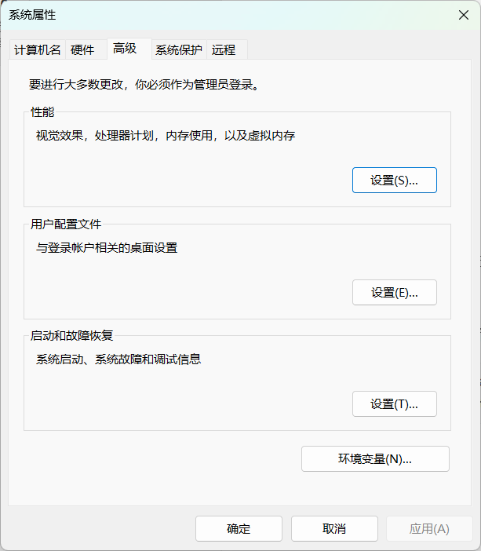

- 双击“Path”；(你可以任意选择用户变量或系统变量中的 Path，当计算机的用户只有一个时，这二者是等效的)

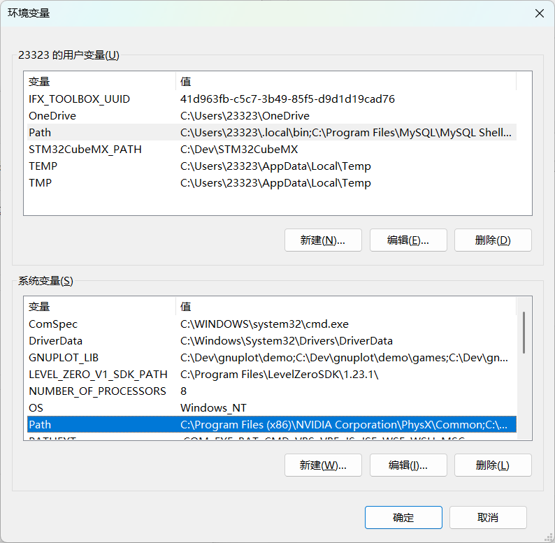

- 新建路径，确定；(请修改为你的实际路径，另外注意 Windows 的反斜杠 \\)

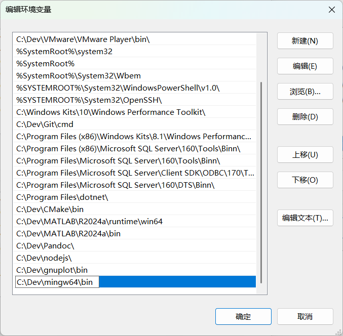

- Win + R，输入 cmd 打开命令行，输入 gcc，若显示：


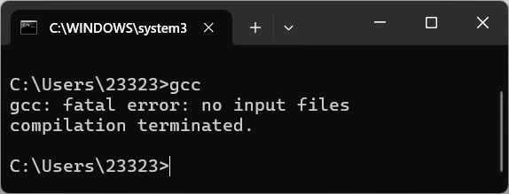

配置成功。


使用方式：

```cmd
gcc input_file.c -o output_file.exe
output_file.exe  # 执行程序
```


#### 2. [Dev-C++](./assets/devcpp-5.1.1.0_64bit_setup.exe)

安装即可，可以按照自己的需求更改安装位置，如：`C:/Dev` 或 `D:/App` 等。


#### 3. [RedPanda](./assets/RedPanda.C++.3.2.win64.MinGW64_11.4.Setup.exe)

界面优雅，与 Dev-C++ 操作基本一致，安装同 Dev-C++。


### Linux(Ubuntu)

Linux 也是一个广泛使用的操作系统，但大部分电脑预装的操作系统是 Windows 系统。如果希望在自己的电脑上使用 Linux 操作系统，一般有两种方法：一是安装双系统，但风险较高；二是使用一种叫做虚拟机的软件。


我们推荐并为大家准备的是第二种解决方案，即使用虚拟机来安装使用 Linux 操作系统。这部分内容较多，有兴趣的同学可以点击链接 [Linux 基础与环境配置](./assets/Linux基础与环境配置.pdf) 查看学习。

- 优点：完全开源，社区支持
- 缺点：新手不友好


#### GCC

在 Linux 上安装 GCC 的指令如下：

```cmd
sudo apt install build-essential  # gcc 包含在 build-essential 中
```


使用方式：

```cmd
gcc input_file.c -o output_file  # 这里不需要.exe
output_file  # 执行程序
```


## 三、(选做) 号称史上最全面的开发工具：VSCode

VSCode 是一个强大的文本编辑器，以“轻量级、高性能、强扩展”为核心特色，是前端、后端、全栈及数据科学等领域开发者的首选工具。

完成 VSCode 的安装配置以及可以成功地在 VSCode 上编写 C 语言代码并不是一件容易的事（助教的许多同学存在因为配置不当只能裸眼 debug 一学期的情况，当然这也不失为一种提升编程能力的好办法）。

这里我们推荐一篇博客，它详细介绍了针对 C/C++ 的 VSCode 安装及环境配置的过程。阅读前提示：本博客的第三部分内容与上文中 GCC 环境配置等效，如已安装则无需重复。

[VS Code 配置 C/C++ 编程运行环境（保姆级教程）_vscode配置c++环境-CSDN博客](https://blog.csdn.net/qq_42417071/article/details/137438374)。


## **四、实验环境测试**

本节测试以 Dev-C++ 为例，讲解如何在 Dev-C++ 上编译和运行程序。

（1）打开 Dev-C++ ，创建 `.c` 文件；

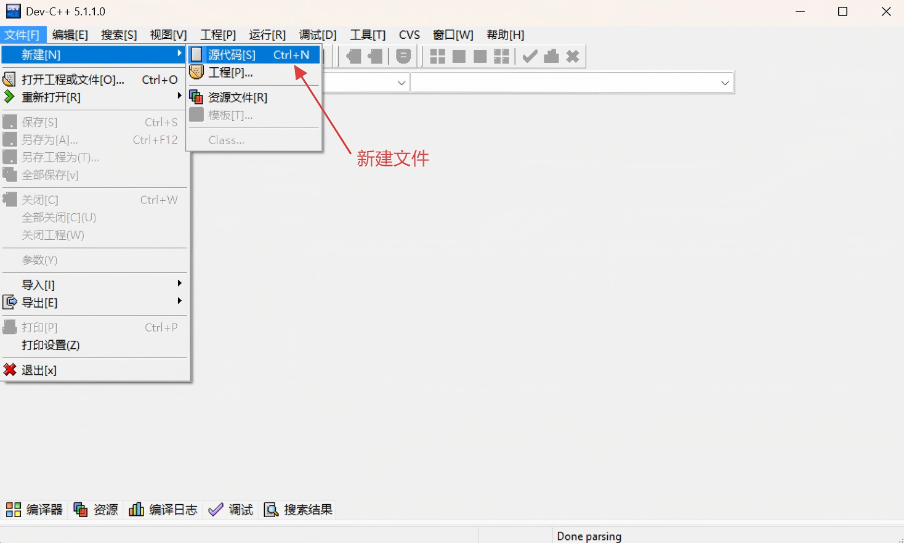

（2）将下面的代码复制粘贴到文件中，点击如下图中的按钮，编译并运行程序；

```c
#include <stdio.h>

int main(void) {
	printf("Hello, world!\n");
	getchar(); // 如果不添加这一行有可能出现终端（小黑窗）闪现的问题
	return 0;
}
```

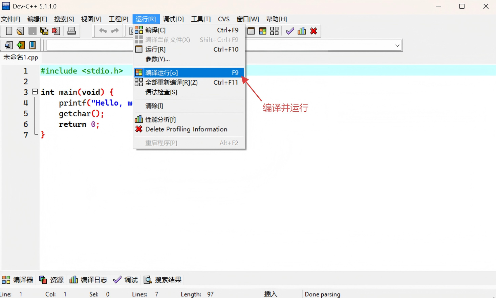

（3）如果在终端（小黑窗）输出 Hello, world!，那么恭喜，你的环境配置成功。

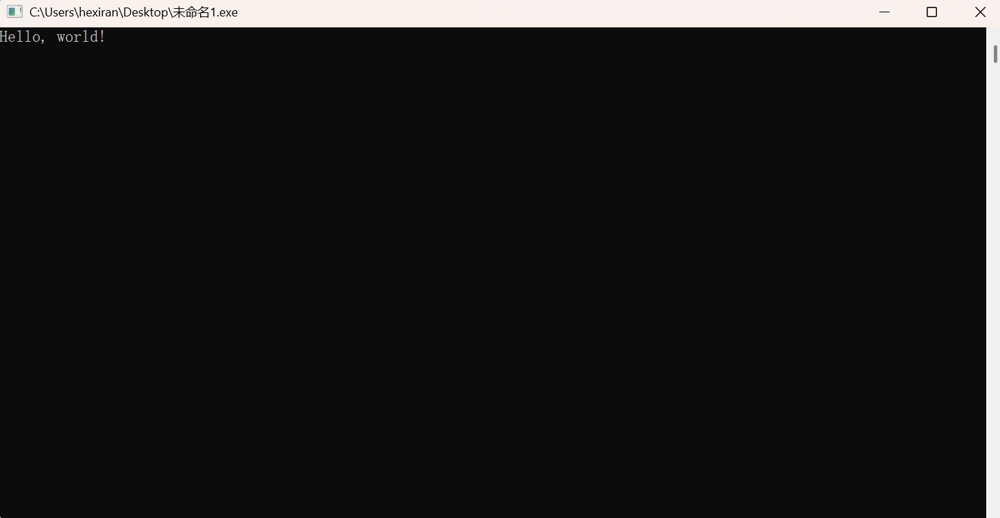


## **五、以 Dev-C++ 为例，学习调试程序**

调试程序，就是控制程序逐行执行，从而看到每个变量的具体变化情况，以及函数的调用过程。对于初学者或是编写一些较短的程序而言，这是很值得学习和使用的方法。


本节我们以一段完整的 C 语言程序为例，系统地学一下如何用 Dev-C++ 调试程序。

```c
#include <stdio.h>
int add(int a, int b){
    int c = a + b;
    return c;
}

int main(){
    int a = 10, b = 20;
    int sum = add(a, b);
    printf("sum = %d", sum);
    return 0;
}
```


默认情况下，程序会瞬间从开头执行到结尾，除非中途出现错误（称为“运行时错误”，比如内存读取失败）。要想让程序暂停执行，就需要设置一个断点。


所谓**断点**，可以简单地理解成障碍物，汽车遇到障碍物不能通行，程序遇到断点就会暂停执行。Dev-C++ 给程序设置断点的方法很简单，想在哪一行代码处暂停执行，直接单击代码所在行的行号即可。例如：

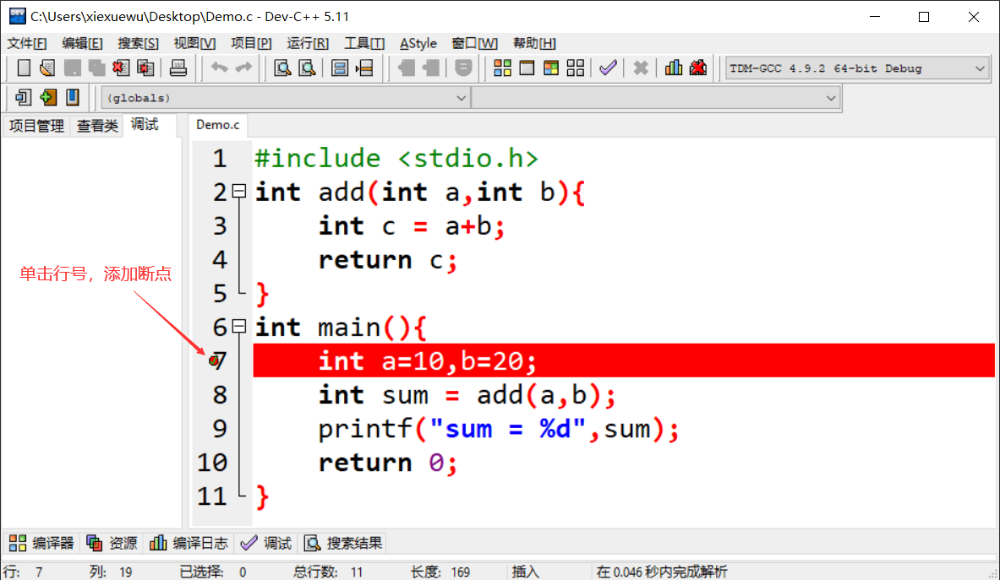


如上图所示，我们成功地在第 7 行代码处添加了一个断点。

> **【注意】**以正常方式点击“编译运行”按钮（快捷键是 F9）运行程序，断点是不会生效的，只有点击“调试”按钮（快捷键是 F8）运行程序时才有效。


> **【注意】**只有在“Debug”模式下才能使用调试功能，如上图所示，本节选用的是“TDM-GCC 4.9.2 64-bit Debug”模式。

点击“调试”按钮，或者按下快捷键“F8”，程序开始执行，直到第 7 行代码处（当前行代码尚未运行）暂停，如下所示：

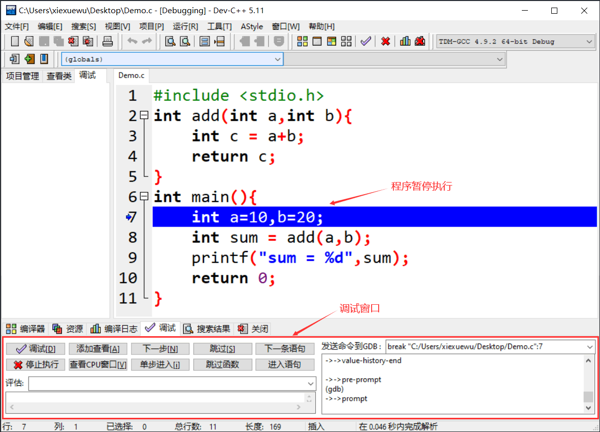


当程序暂时执行时，借助调试窗口中的按钮可以查看某些变量的值，还可以控制编译器继续往下执行程序。整个调试窗口中，常用的按钮以及含义分别是：

- 添加查看：查看某个变量的值，还可以看到值的变化情况；
- 下一步：控制编译器向下执行一行语句；
- 单步进入：功能和“下一步”按钮类似，不同之处在于，当程序中调用某个自定义的函数时，此按钮可以进入到函数内部，继续调试函数内部的代码，而 "下一步" 按钮不会；
- 跳过：继续执行程序，遇到下一个断点暂停执行；
- 停止执行：停止调试程序。

举个例子，点击“添加查看”按钮监视变量 sum 值的变化情况，添加之后如下图所示：

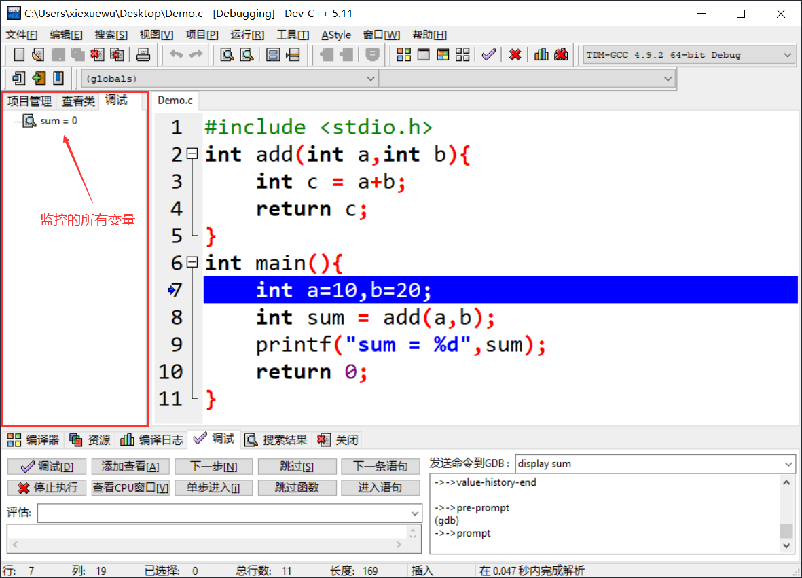


初始状态下，变量 sum 的值为 0。点击“下一步”，执行第 7 行代码，箭头光标指向第 8 行，变量 sum 的值仍为 0。再点击“下一步”，执行第 8 行代码，箭头光标指向第 9 行，变量 sum 的值变为 30。

> 当箭头光标指向第 8 行代码时，点击“单步进入”按钮，箭头光标会进入 add() 函数并指向第 3 行代码，感兴趣的读者可自行尝试。


调试过程中，Dev-C++ 支持同时监控多个变量，还支持在程序中设置多个断点，如下图所示：


以上就是我们所要介绍的调试程序的内容，最后我们提醒大家，对于修改后的程序，调试程序之前一定要先编译程序！