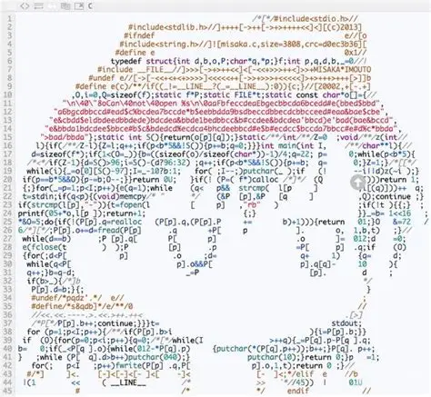

# **实验1：求素数**


## 一、代码规范

想看看世界乱码大赛的获奖作品吗？



也许你认为你写的代码与它一样优美，但在习惯了严格缩进和空白习惯的助教看来，它们一样都晦涩难懂。

我们非常建议同学们产出的是一份代码，而非“一条”代码~

下面给出一份建议的代码规范，可以让你的代码看起来上一个“档次”。

!!! note
	​这里说的是“建议”而不是“要求”，如果你暂时没想好自己想用什么样的代码风格，严格按照下面的规范即可；如果你已经有了自己的代码风格，继续沿用就好。但我们希望你在一份代码中能统一使用一种风格。


### 1. 标识符

#### 变量名

全小写，单词之间用 '\_' 隔开，如 `user_name`。

#### 宏/常量

全大写，单词之间用 '\_' 隔开，如 `MAX_BUFFER_SIZE`。

#### 结构体名

所有单词首字母大写，单词之间不分隔，如 `TeacherAssistant`。


### 2. 缩进

在具有结构层次的代码块中使用缩进，一般使用 4 个空格而非 Tab，这可以使得代码在不同编辑器中显示混乱。

需要缩进的代码块一般为：

#### 函数体

```c
int main(void) {
	stmt;
	
	return 0;
}
```

#### `for` 循环、`while` 循环和 `do-while` 循环

```c
for (init; cond; update) {
	stmt;
}
```

#### `if-else` 结构

我们建议所有的 `if-else` 语句都使用大括号，这个习惯可以让你规避很多 bug。

```c
if (cond) {
	stmt;
} else {
	stmt;
}
```

#### 语句块

```c
int main(void) {
	{
		blockstmt;
	}
	
	return 0;
}
```


### 3. 空格

一般在运算符两侧、分隔符 (; ,) 右侧添加空格。

修饰性的空格在程序中没有实际上的语义作用，但可以让读者心情愉悦，例如：

```c
for (int i = 0; i < 5; i++) {
	printf("Hello, world!\n");
}

for(int i=0;i<5;i++){
printf("Hello,world!\n");
}
```

你认为哪个更让你有阅读的欲望？


### 4. 注释

你写的代码第一天你和上帝可以看懂，第二天就只有上帝能够看懂。

如果你希望其他人能够快速理解你的代码，好的注释习惯是必不可少的。注释并不是越多越好，你需要在合适的代码结点给出合适的注释，例如：

```c
free(ptr);
ptr = NULL; // 防止后续误访问
```


## 二、标准答案

### 时间复杂度 $O(N\sqrt{N})$

```c
#include <stdio.h>
#include <math.h>
#include <stdbool.h>

// 判断一个数是否为素数
bool is_prime(int num) {
    if (num < 2) {
        return false;
    }
    if (num == 2) {
        return true;
    }
    if (num % 2 == 0) {
        return false;
    }
    // 只需检查到平方根即可
    int sqrt_num = (int)sqrt(num) + 1;
    for (int i = 3; i <= sqrt_num; i += 2) {
        if (num % i == 0) {
            return false;
        }
    }
    return true;
}

// 统计a到b范围内的素数个数
int count_primes_in_range(int a, int b) {
    int count = 0;
    for (int num = a; num <= b; num++) {
        if (is_prime(num)) {
            count++;
        }
    }
    return count;
}

int main() {
    int n, a, b;
    
    // 读取输入
    scanf("%d", &n);
    scanf("%d %d", &a, &b);
    
    // 输出结果
    printf("%s\n", is_prime(n) ? "YES" : "NO");
    printf("%d\n", count_primes_in_range(a, b));
    
    return 0;
}
```

